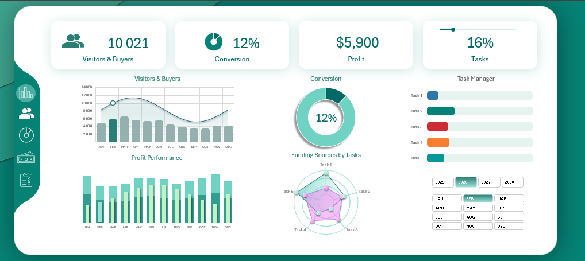
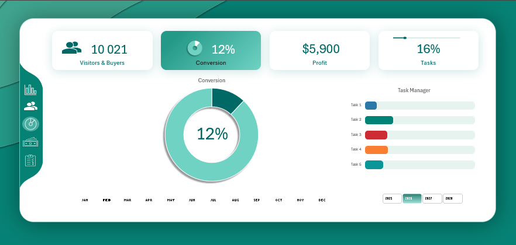
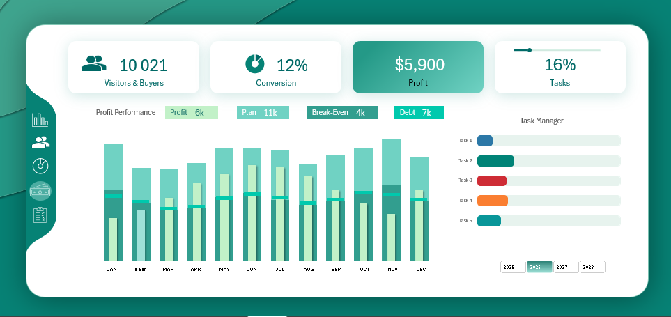
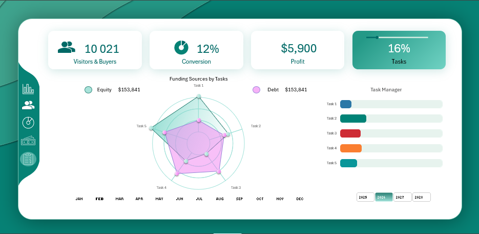

# Business Performance Excel Dashboard

## 📊 Project Overview
This project is a **business performance dashboard built in Microsoft Excel**, designed to help decision-makers monitor **visitors, buyers, conversion rate, profitability, and task execution** in a clear and actionable way.

The dashboard is **based on an open-source Excel template** and was **significantly customized and enhanced** to reflect real-world business requirements and executive reporting standards.

---

## 🎯 Objectives
- Provide a clear overview of overall business performance
- Track key commercial and operational KPIs
- Support data-driven decision-making
- Improve visibility into conversion efficiency and profitability

---

## 📈 Key KPIs
- Visitors & Buyers
- Conversion Rate
- Profit Performance
- Task Completion Progress
- Funding Sources by Tasks

---

## 🛠 Tools & Techniques
- Microsoft Excel
- Pivot Tables & Pivot Charts
- Slicers and Interactive Filters
- Advanced Chart Formatting
- Dashboard Design Best Practices

---

## 🔧 Key Enhancements
- Redesigned and refined core business KPIs
- Improved dashboard layout and visual hierarchy
- Optimized chart selection for trends and performance comparison
- Enhanced profit analysis (Actual vs Plan vs Break-even vs Debt)
- Added dynamic time-based filters (Year / Month)
- Applied a consistent and professional color theme

---

## 📷 Dashboard Screenshots

### 🔹 Dashboard Overview

### 🔹 Visitors & Buyers Analysis

### 🔹 Conversion Rate

### 🔹 Profit Performance

### 🔹 Task Progress

---

## 👥 Target Users
- Business Managers
- Operations Teams
- Sales & Marketing Analysts
- Executives and Decision Makers

---

## 💡 Use Case
This dashboard helps organizations track performance over time, compare actual results against plans, and identify operational and financial gaps to support better decision-making.

---

## 📝 Notes
This project demonstrates the ability to **analyze business requirements, customize existing analytical solutions, and deliver a professional Excel dashboard** with strong business context.

---

## 🚀 Future Improvements
- Add Month-over-Month (MoM) and Year-over-Year (YoY) growth metrics
- Introduce dynamic targets and variance analysis
- Include an executive summary with automated insights
- Extend the dashboard with scenario and what-if analysis

---

## 👤 Author

**Mahmood Mamdouh**  
Data Analyst | Excel & Business Analytics  

- GitHub: https://github.com/MahmoooOod  
- LinkedIn: https://www.linkedin.com/in/mahmoud-mamdouh-324125220/

This project is based on an open-source Excel template and was **significantly customized and enhanced** by the author to demonstrate business analysis, KPI design, and executive dashboarding skills.
